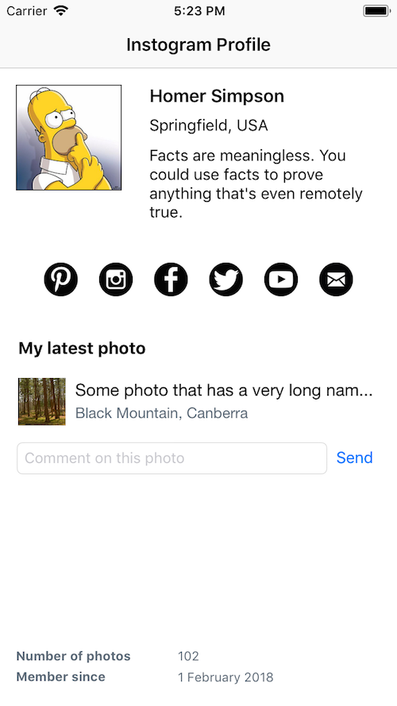

# Auto Layout Challenge 1

**NOTE:** This is a challenge activity and is intentionally designed to be tricky. Challenging, but achievable!

You are creating the profile screen for Instogram. It needs to display correctly in portrait orientation ONLY on all iPhone devices which support iOS 11 (you do not need to support iPad).

Here are some guidelines about the design of the screen:

* The profile picture should always be square.

* The profile picture should take up one-third of the screen width. Name, location and blurb should fill the remaining two-thirds of the screen width.

* The profile picture should be be aligned to the top of the text.

* The quote text (i.e. currently set as "Facts are meaningless...") could change total height, depending on the length of the text (if the text was to be replaced with something else) and/or the device screen size. The content beneath the quote needs to adjust downwards accordingly. For example, the social buttons are not fixed in place...they are always 29 points below the bottom of the quote label.

* You do not need to worry about pixel perfect distances between items (unless specifically defined here) so long as it looks generally correct.

* The social icons should be evenly spaced across the full width of the screen.

* The name of the photo should truncate if too long.

* The text field should fill the available width, and the send button is always on the right-hand side.

Here are some examples of the app on various different devices.

### iPhone 8 Plus

<kbd>
  
</kbd>

### iPhone 8

<kbd>
  
</kbd>

### iPhone 5S

<kbd>
  
</kbd>

.

*Adapted from: https://github.com/stephsharp/AutoLayoutWorkshop*