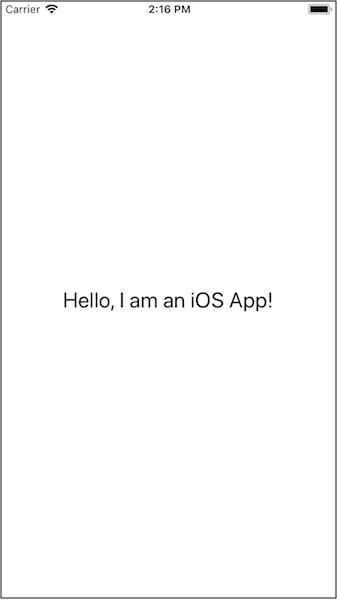

# Auto Layout Activity 1

This activity is just to provide you with some basic experience in using Auto Layout constraints.

Download the project and run it up in the iPhone 8 simulator. You should see that the label is positioned perfectly in the center of the screen.

<kbd>
  
</kbd>

Now run the project in some of the other simulators. You will see that the label no longer is positioned in the center. Implement the required alignment constraints to make it appear in the center of the screen regardless of the device upon which it runs.

Hint: You will only need two constraints - a horizontal alignment constraint, and a vertical alignment constraint.