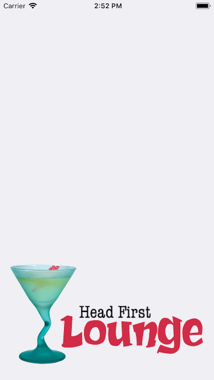
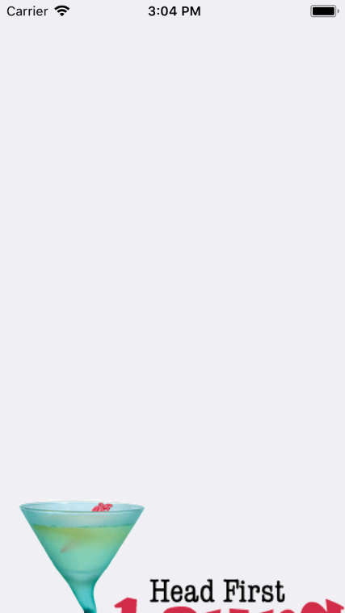

# Auto Layout Activity 2

The Head First Lounge makes its grand reappearance in this activity!

You are designing an app for the Head First Lounge, and need to put the logo at the bottom of the screen - so it's fully visible at all times, takes up the width of the screen, and doesn't leave blank gaps or gets cut-off. It appears great on the iPhone 8:

<kbd>
  
</kbd>
.

...but not quite right on an iPhone 8 Plus:

<kbd>
  
</kbd>
.

...and even worse on an iPhone 5S:

<kbd>
  
</kbd>
.

Apply the correct constraints to the image so that it displays correctly on all screen sizes.