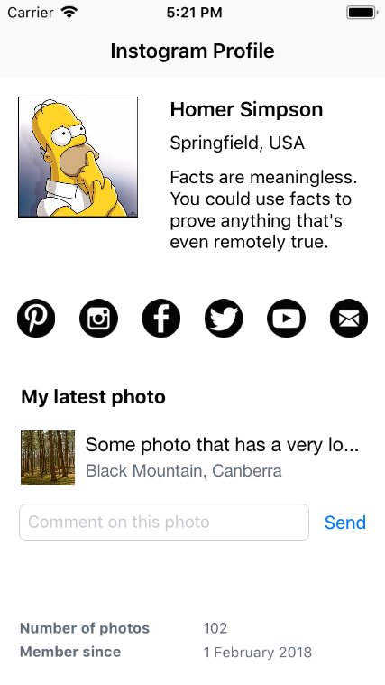

# Auto Layout Activity 3

You're designing a new app called Instogram - an instant photo sharing app, not to be confused with a similar product with a similar name.

You user interface needs to display a grid of images and fill the entire safe area of the screen regardless of screen size.

Download this project and make it happen! Here is an example of the app running on an iPhone 8 Plus:

<kbd>
  
</kbd>

.

...and (at the other end of the size spectrum) an iPhone 5C:

<kbd>
  
</kbd>